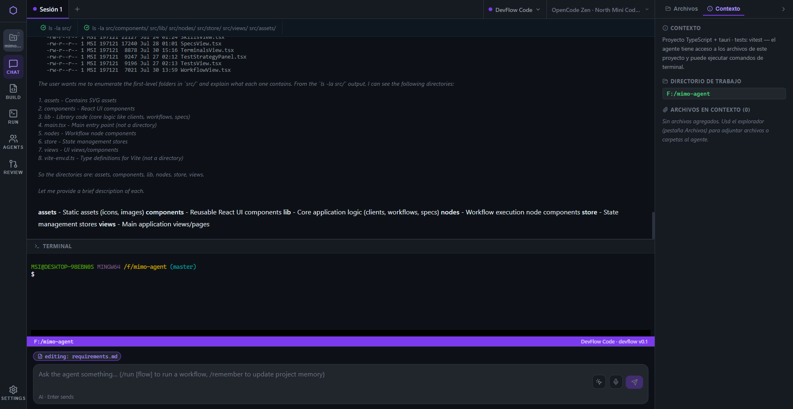
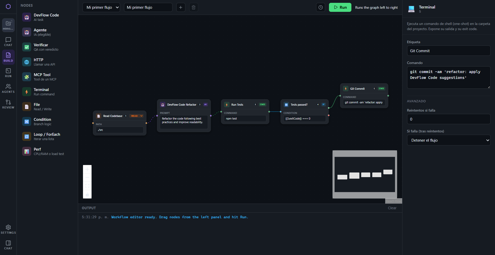
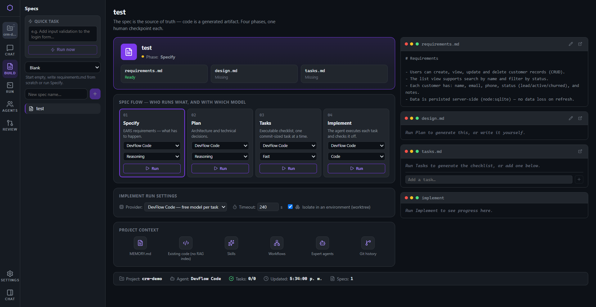
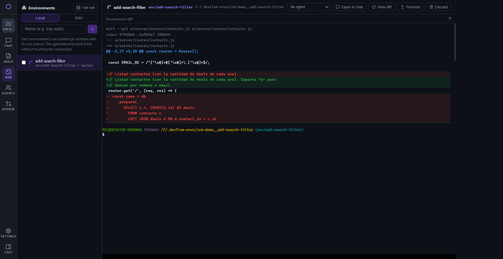
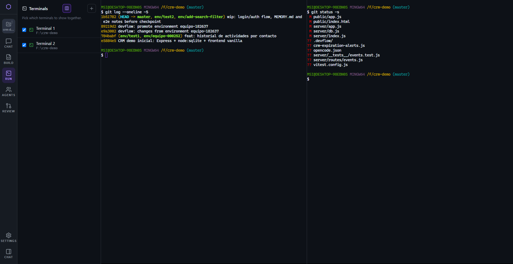
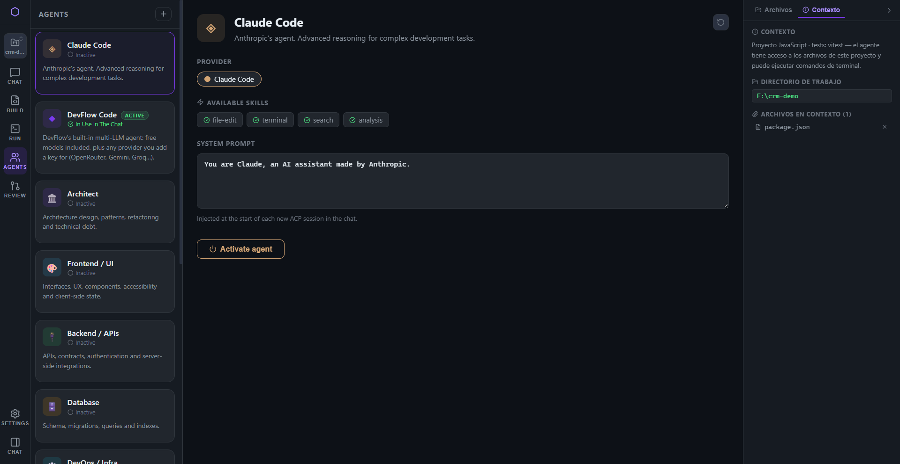
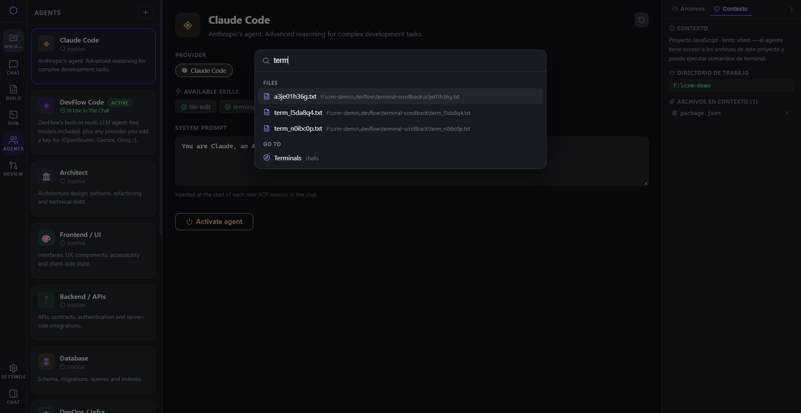
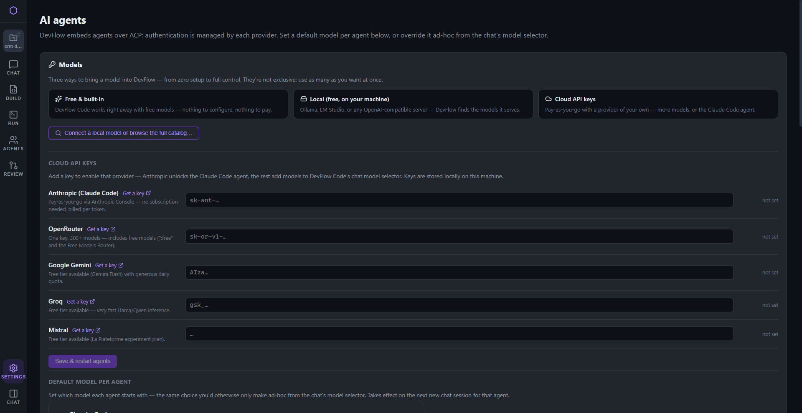
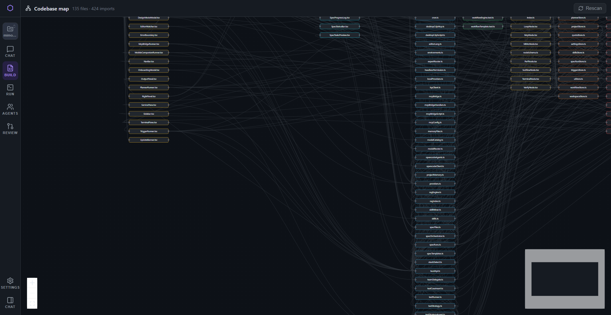

# DevFlow

A desktop IDE where AI agents are first-class citizens — chat, code editor, workflow automation,
spec-driven development, parallel isolated environments, and a team of specialized agents, all in
one native app (Tauri + React).

DevFlow embeds agents over **ACP** and OpenCode's native protocol, so it works with free built-in
models out of the box, local models (Ollama / LM Studio), or your own cloud API keys (Anthropic,
OpenRouter, Gemini, Groq, Mistral…) — never locked to a single provider.

## Screenshots

### Chat — agents that read and run your real code

The agent explores the actual project (`ls`, file reads) and answers from what it finds, with an
integrated terminal, per-workspace context, and a per-agent model picker.



### Workflows — visual automation builder

Chain AI tasks, shell commands, conditions, and loops into a graph. Runs left to right, with retries
and failure handling per node.



### Specs — spec-driven development

Specify → Plan → Tasks → Implement, with a human checkpoint at each phase and a different
model/agent assignable per phase.



### Environments — isolated git worktrees, fan-out, and diff review

Every environment is its own worktree/branch. Fan out one prompt to several agents in parallel,
compare their diffs side by side, and promote the winner (or discard the rest) in one step.



### Terminals — real shells, split view

Multiple independent PTYs with WebGL rendering and persistent scrollback, viewable side by side.



### Agent catalog — a team of specialists

Beyond a single assistant: Architect, Frontend, Backend, Database, DevOps, Security, QA and more,
each with its own system prompt, skills, and provider.



### Command palette — Ctrl+K for everything

Jump to any file, workflow, agent, project, or view without touching the mouse.



### Settings — bring your own models

Three ways to get a model into DevFlow: free built-in, local (Ollama/LM Studio), or your own cloud
API key — all usable at once, configured per agent.



### Codebase map

An auto-generated dependency graph of the active project, useful for getting oriented in a codebase
you didn't write.



## Feature overview

- **Build** — Code editor with LSP (hover/autocomplete/find-references), Specs (spec-driven dev),
  Codebase map, Workflows (visual automation), Planner (dated tasks).
- **Run** — Terminals (splits, persistent scrollback), Services (long-running processes),
  Environments (worktrees, SSH worktrees, fan-out + diff + promote), Tests (catalog, QA fallback,
  generate/insert cases).
- **Agents** — Agent catalog (specialist team), Skills (shareable, project- or global-scoped),
  MCP servers (tools) — agents can also create/run DevFlow workflows themselves via a native MCP
  bridge.
- **Review** — GitHub (PRs/issues via `gh`, open a PR as an environment).
- Cross-cutting: Triggers (scheduled/webhook-driven workflow runs), Mobile Companion (local-network
  HTTP bridge to follow up on a workspace from your phone), Design Mode (click an element in your
  own app to send its HTML/CSS/screenshot to the agent), per-project memory and RAG.

## Tech stack

- **Frontend**: React + TypeScript, Vite, Zustand, `@xyflow/react` (workflow graph), CodeMirror 6
  (editor + LSP client), `@xterm/xterm` (terminals).
- **Backend**: Tauri v2 (Rust) — PTY spawning, local HTTP servers (webhooks, MCP bridge, mobile
  companion), window management.
- **Agents**: ACP (Agent Client Protocol) and OpenCode's native HTTP+SSE protocol, via the bundled
  OpenCode sidecar or Claude Code.

## Getting started

```bash
npm install
npm run tauri dev    # desktop app, hot-reloaded
npm test             # vitest
```

See `docs/GUIA-DEVFLOW.md` for a full walkthrough (Spanish) and `docs/PRUEBA-E2E.md` for the manual
test plan.

## License

Proprietary — see [LICENSE](LICENSE). Compiled binaries are distributed separately via
[devflow-releases](https://github.com/SynapseIA25/devflow-releases); this repository is the private
source. Third-party components are listed in [NOTICE.md](NOTICE.md).
